# Jing-Zhang Urban Capability Exchange

> **Thesis: Jing-Zhang is not a city filled with AI; it is an urban operating system that continuously produces, exchanges, tests, improves and retires public capabilities.**

This is an AI-Agent-generated open co-creation proposal. Final judgment, professional deepening and statutory procedures remain human responsibilities.

## Design Basis and Source List

The proposal treats the Centennial Jing-Zhang corridor as a **city-scale public-capability operating system**. AI enters the city only through diagnosed problems, risk authorization, reversible tests, public-value review, capability exchange and retirement. The three official positioning themes, five functions and Three Areas / Two Wings remain fixed taskbook objectives; this proposal supplies an urban and governance mechanism for them. [source:AGENT-TASKBOOK] [source:OFFICIAL-ANNOUNCEMENT]

SITE_BOUNDARY and all three KEY_AREA polygons remain provisional constraints. Evidence provenance (Official / Verified / Derived / Assumed / Unknown) is kept separate from drawing status (Known / Estimated / Proposed / Unknown). Exact organizer polygons, statutory controls, ownership, road redlines, heritage, utilities and a complete existing-building survey must trigger recalculation. [source:BOUNDARY-SOURCE] [assumption:A-BOUNDARY-001]

**Official-boundary background audit.** The latest repository-maintained basis records an independent OSM background comparison: the OSM-mapped Jing-Zhang Railway Heritage Park has 0% intersection with the current `PROV-SITE-001` reading and a nearest distance of about 412.5 m, while the coordinated research scope covers it fully. Maintainers explicitly state that this does **not** prove whether OSM or the provisional polygon is correct and cannot justify upgrading or silently changing the official redline. All exact siting therefore remains provisional until organizer polygons trigger full recalculation. [source:PROVISIONAL-BOUNDARY-BASIS] [assumption:A-BOUNDARY-001]
<!-- OFFICIAL-COMPLETENESS:BOUNDARY-AUDIT -->

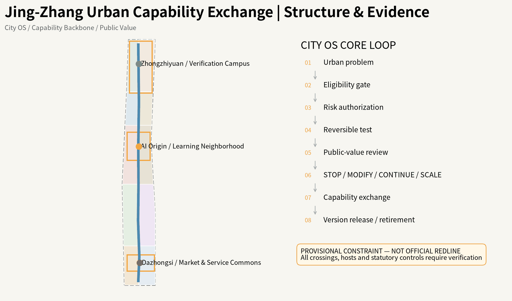

## Three-Level Scope Framework

The approximately 43.6 km² coordinated research scope addresses ecosystem and regional cooperation; the approximately 11.4 km² overall-design scope addresses urban structure, public space and renewal; the three key areas carry perceptible detailed design. The task-text reference areas of 192.1/104.3/72.0 ha remain separate from the provisional polygon calculations. [metric:key_area_reference_total_sqm] [assumption:A-KEY-AREA-001]

The spatial grammar is **one Capability Backbone plus five differentiated Learning Units**. The Backbone is not a proposed new road: it combines memory, walking/accessibility, public realm, blue-green ecology, capability nodes and event/operations layers. [metric:capability_backbone_layer_count] [data:geometry/roads.geojson#ROAD-001]

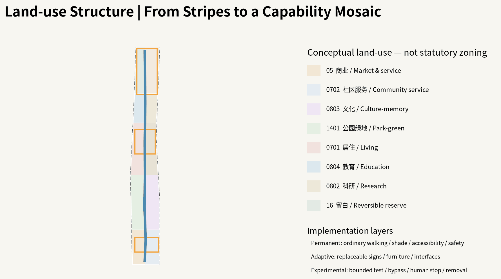

## Coordinated Research Area: Industry and Future City Research

The five units specialize by actual resource logic: Zhongzhiyuan for technical production and higher-risk validation; AI Origin for social learning, talent daily life and public service; Dazhongsi for market and AI-native service validation; Zhongguancun Technology Service Wing for IP/capital/legal/standards/global services; Xiaoyuehe for blue-green public-life and low-risk real-city testing. Current official public material supports these role directions, not precise competition polygons. [source:SRC-BJ-CITYUPDATE-ZZY-20260713] [source:SRC-BJ-AIORIGIN-TALENT-20260720] [source:SRC-BJ-CITYUPDATE-DZS-20260713]

Six global cases are translated as mechanisms rather than copied forms: Punggol living labs, Seoul digital inclusion, Enabling Village universal design, Woven City real-world testing, Decidim traceable participation and Kalasatama everyday mixed urbanism. Jing-Zhang adds public value, failure disclosure, human alternatives, transfer revalidation and retirement. [source:GLOBAL-PUNGGOL] [source:GLOBAL-DECIDIM] [source:GLOBAL-KALASATAMA]

Regional coordination is a **capability-exchange interface**, not an institution list. Jing-Zhang may exchange validated urban capabilities, test protocols, evidence and talent/service mechanisms with Zhongguancun, Future Science City, Huairou Science City, Beijing E-Town and the wider Beijing-Tianjin-Hebei university/research/industry network, but every transfer requires target-context revalidation. No signed partnership or resource commitment is claimed. [source:AGENT-TASKBOOK]

Regional coordination is shown as capability exchange rather than an institution collage. Zhongguancun, Future Science City, Huairou Science City, Beijing E-Town and wider Beijing–Tianjin–Hebei networks are target contexts for transfer; every transfer requires renewed checks of fit, equity, risk and public value, with no claim of signed institutional commitment.

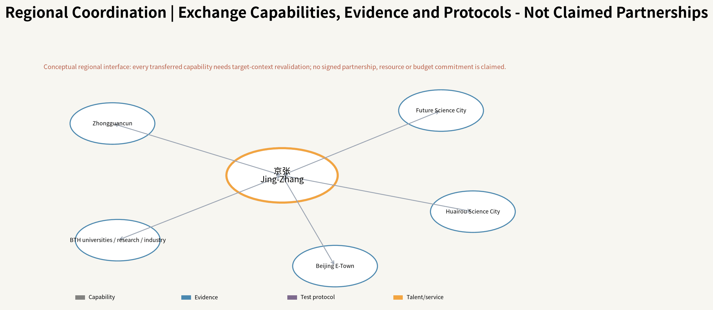

## Overall Design Area: Urban Renewal and Regulatory-Plan-Level Urban Design

The Capability Backbone uses the real public-space relationship of the historic Jing-Zhang corridor, but every crossing passes an evidence gate. Until roads, rail, water, heritage and rights-of-way are verified, drawings show a required connection relationship rather than an invented bridge, tunnel or statutory route. [data:geometry/roads.geojson#ROAD-002] [assumption:A-ROAD-001]

Urban construction is divided into **Permanent / Adaptive / Experimental** layers. Permanent elements keep ordinary walking, shade, accessibility, lighting, fire safety and non-AI services. Adaptive elements are replaceable interfaces and furniture. Experimental elements require bounded time/space, a nonparticipant bypass, human stop authority and removal conditions. [assumption:A-NONAI-001] [data:geometry/phasing.geojson#PHASE-001]

Five typical sections translate the masterplan into vertical relations among ordinary walking, shade, railway memory, PCI, slow-mobility stitches and reversible tests. They test whether the city works first and only then locate AI interfaces; they are urban-design intentions, not road-redline, utility, structural or survey drawings.

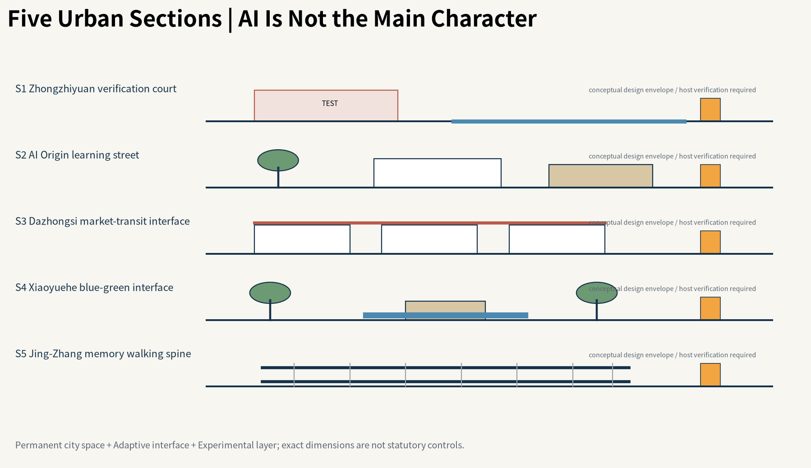

## Detailed Design of Key Areas

**Zhongzhiyuan - Verification Campus.** Higher-risk tests are isolated, observable and reversible without interrupting ordinary work and walking.

**AI Origin - Learning Neighborhood.** Public service, accessibility, talent daily life and community co-creation come first; personal or recognition functions require a Consent Layer.

**Dazhongsi - Market & Service Commons.** Mixed commuters, merchants, couriers, residents and visitors provide a real service-validation environment instead of a closed technology park. Exact hosts remain subject to official polygons, ownership and existing-building evidence. [data:geometry/key_areas.geojson#KEY-001] [data:geometry/public_space.geojson#PUBLIC-003] [assumption:A-CONTROLS-001]

To respond explicitly to the organizer's named key-area tasks, the three prototypes are extended as **professional-deepening checklists, not determined engineering schemes**:

- **Zhongzhiyuan / Verification Campus:** combine full-stack autonomous AI with standards and safety-governance testing; Fifth Ring external access, Qinghe cultural resources, building-green-water integration and AI-enabled green-space scenarios are mandatory follow-up checks, with crossings, capacity, building scale and engineering alignments subject to real mobility, water, ownership and planning evidence.
- **AI Origin / Learning Neighborhood:** connect university-origin innovation, incubation/conversion, talent/open-source communities and brand activities to everyday public services; Wudaokou and Qinghuadongluxikou station areas are framed only as TOD/slow-mobility research tasks, with low-disturbance reversible renewal preferred over wholesale demolition. Exact retain/renovate decisions, transfer hosts and housing/support facilities require verified building and ownership evidence.
- **Dazhongsi / Market & Service Commons:** test AI-native services around agents, intelligent terminals, content consumption and digital-asset services; four-quadrant pedestrian links at Dazhongsi Station, bicycle/static-traffic organization and composite use of planned green space remain detailed-design questions that must first verify road redlines, green-space status, fire safety and operations.

This converts organizer requirements into **urban-design questions that must be verified**, not government commitments, approvals or construction conditions. [source:OFFICIAL-ANNOUNCEMENT] [assumption:A-CONTROLS-001]
<!-- OFFICIAL-COMPLETENESS:KEY-AREAS -->

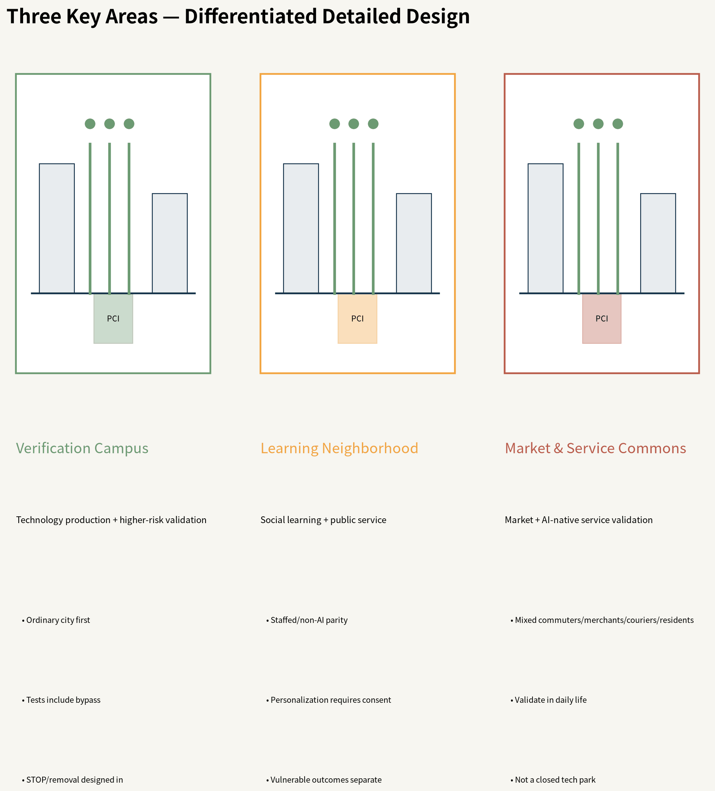

<!-- REVIEWER-SPATIAL-DEEPENING:V4 -->
### Reviewer Lens: Three Key-Area Spatial Proof Rooms

To move the three key areas beyond a task checklist, this iteration turns each KEY_AREA into a **30-second spatial proof**. Every area must make eight things immediately legible: **its urban role, ordinary movement, core public room, ground-floor relationship, blue-green function, where AI moves backstage, the non-participant bypass, and what evidence is still missing**. The following deepening is **Derived / Not yet canonicalized**. The formal `KEY_AREA` geometry remains provisional, while statutory FAR/height, ownership, road redlines, legal green-space status and engineering capacity remain Unknown.

| Key area | First spatial question | Core spatial rooms | Ordinary-city baseline | AI backstage position |
|---|---|---|---|---|
| Zhongzhiyuan / Verification Campus | How can higher-risk capabilities be tested without interrupting ordinary urban life? | Verification Commons Court / Bounded Test Yard / Governance Review Hall / Ordinary Bypass | continuous walking, signage, shade, lighting, manual safety control and physical stop | controlled test/review layers; public edge remains readable without AI |
| AI Origin / Learning Neighborhood | How can universities, talent and neighborhoods share low-disturbance public-service space? | Campus-Neighborhood Learning Commons / Inclusive Service Court / TOD Walking Gate / Low-disturbance Renewal Edge | physical accessibility, ordinary wayfinding, manual help and fixed service information | low-risk Ambient support only by default; personalization/recognition enters Consent Layer |
| Dazhongsi / Market & Service Commons | How can AI-native services be tested in real commerce and night-time public life? | Four-Quadrant Walking Stitch / Market Service Street / Night Urban Living Room / Green Mobility Court | ordinary commerce, visible wayfinding, staffed help, safe walking and lighting | service orchestration supports users/merchants but never replaces ordinary transaction, navigation or help |

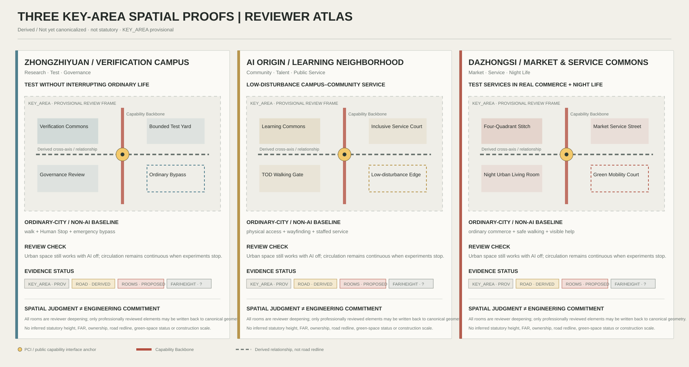

**Zhongzhiyuan deepening.** Public-facing research commons and governance-review interfaces sit on the public edge, while controlled experiments move inward. Every bounded test yard must pair its safety buffer and Human Stop with an ordinary bypass and emergency access. Fifth Ring links, Qinghe cultural resources and building-green-water integration remain evidence-gated specialist tasks rather than assumed engineering crossings.

**AI Origin deepening.** Fine-grain campus-neighborhood stitches, inclusive service courts and low-disturbance renewal replace the image of a sealed AI park. Wudaokou and Qinghuadongluxikou station relationships remain walkshed/public-life research tasks. Physical accessibility and staffed/manual service are Permanent baselines; personalized AI cannot replace ordinary civic service.

**Dazhongsi deepening.** Four spatial proofs organize the review: four-quadrant walking continuity, a market-service street, a night urban living room and a green mobility court. Loading, cycling, static transport and night-time public life are reviewed together. Any crossing, planned-green multifunction use or parking arrangement remains conditional on verified road, green-space, fire-safety and operating constraints.

These Spatial Proof Rooms are a **reviewer-facing explanatory layer**. They do not override canonical GeoJSON. Only after professional review should approved road sections, public-space components and scenario nodes be written back into canonical geometry.

## AI Innovation Ecosystem, Personas, and AI+ Scenarios

A Public Capability Interface (PCI) is a six-layer civic contract: **Non-AI Baseline / Ambient Layer / Consent Layer / Human Override / Failure-Safe Mode / Public Learning Record**. It is not a kiosk typology. Shade, seating, access, staffed service and emergency procedure must work before AI is added. [metric:public_capability_node_type_count] [data:geometry/public_space.geojson#PUBLIC-001]

Eight personas are evaluated: researchers/entrepreneurs; students/developers; local families; older users; disabled/low-vision/deaf users; couriers/cleaners/security/frontline operators; merchants/service operators; international visitors/industry partners. [metric:persona_count]

Twelve scenarios cover cultural interpretation, accessible routing, multilingual service, safe night return, developer opportunity discovery, education, non-diagnostic health navigation, last-mile robot testing, low-speed autonomous-vehicle testing, edge-compute/energy tests, heat/storm response and public-proposal traceability. Four are explicit bounded test/validation scenarios. [metric:scenario_card_count] [metric:test_validation_scenario_count]

The three registered scenario IDs used for repository discovery are `public-safety-operations-review`, `ai-traffic-walkability`, and `enterprise-service-copilot`. The twelve project scenario cards subdivide these civic tasks and add railway culture, accessibility, multilingual service, heat/storm response, bounded autonomous tests and proposal traceability. The registry supports discoverability; the twelve cards provide project-specific spatial testing and public-value evaluation.

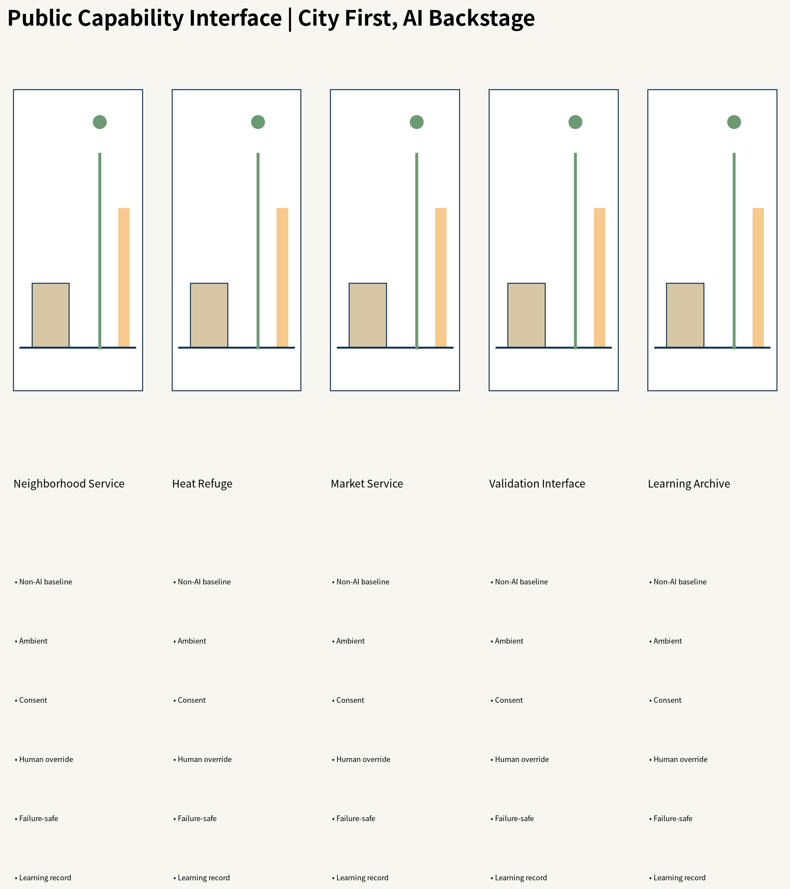

## Land Use, Building Scale, and Retain-Renovate-Demolish Strategy

The land-use mosaic is a conceptual urban-design structure linking research, education, community services, commerce, culture, green space and reversible reserve; it is not a statutory zoning change. BUILDING_FOOTPRINT contains only proposed reversible public-service pavilion envelopes, not fabricated existing buildings. [data:geometry/land_use.geojson#LU-001] [data:geometry/buildings.geojson#BLDG-001]

Total floor area, FAR, existing floors/heights, ownership and full retain/renovate/demolish decisions remain Unknown. Existing-building evidence should be promoted only after OSM, Microsoft ML footprints, official material and field checks are cross-validated. [metric:far] [assumption:A-BASEMAP-001]

## Transport, Rail, Municipal Infrastructure, and Public Services

ROAD-001 is a continuity study axis; ROAD-002–006 are east-west stitch study axes. They express a design problem rather than confirmed roads, bridges, tunnels or engineering redlines. A published Dazhongsi road-opening fact is context, not an area-wide mobility conclusion. [source:SRC-BJ-DZS-ROAD-20260225] [assumption:A-ROAD-001]

Municipal capacity, fire, underground utilities, drainage, flood, structure and energy remain incomplete. The 2026 Xiaoyuehe water and utility works make construction/ecology/safety checks prerequisites for any blue-green test node. [source:SRC-BJ-XIAOYUEHE-WATER-20260112] [source:SRC-BJ-XIAOYUEHE-WORKS-20260121]

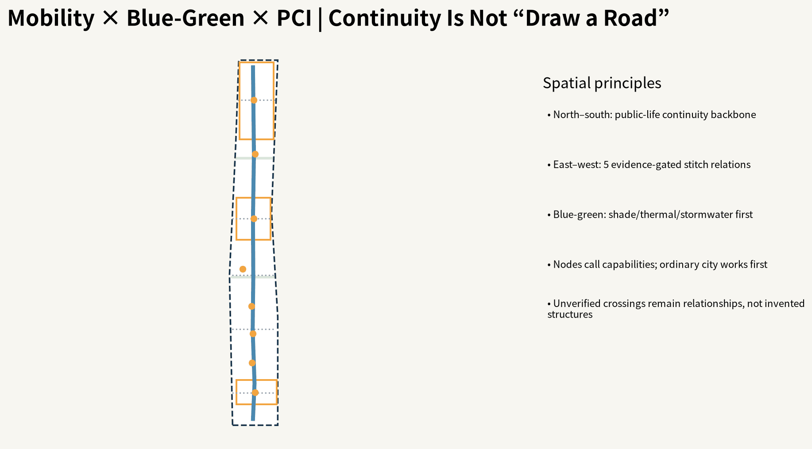

## Blue-Green Network, Public Space, and Urban Character

Public space follows a **city first, AI backstage** Public Service Aesthetic. Double tracks, stations, switches and mileposts become capability flow, open nodes, switching and version memory rather than retro railway decoration or cyberpunk AI imagery. Blue-green design first delivers shade, thermal comfort, stormwater, walking, children/older users and emergency use, then adds sensing or orchestration. [source:SRC-BJ-JZPARK-CATALOG-20250724] [data:geometry/green_space.geojson#GREEN-001]

The same spaces operate as an 8AM–MIDNIGHT Adaptive Commons for commuting, midday rest, children/older users, night culture, markets, extreme weather and emergencies, while node roles remain differentiated.

**Height, intensity, roof and massing guidance (conceptual).** Because statutory height, FAR, density and setback controls are missing, the proposal does not invent numbers. Instead it establishes qualitative rules for later professional deepening: (1) height should step in response to railway memory, blue-green corridors, daylight and important views, with numeric caps set only by verified controls; (2) intensity may concentrate near transit/innovation services only after carrying capacity, daylight, fire and heritage checks, with no assumed FAR; (3) massing should remain porous and phaseable with smaller-grain bases, breezeways and public passages rather than sealed megablocks; (4) roofs are treated as a fifth facade with reversible potential for PV, stormwater, habitat or community use, subject to structural/fire/maintenance review; and (5) character follows a public-service aesthetic and railway structural DNA rather than generic glass-tech parks, retro imitation or neon cyberpunk spectacle. These are urban-design intentions, not statutory building controls. [assumption:A-CONTROLS-001]
<!-- OFFICIAL-COMPLETENESS:FORM-CONTROL -->

Three time landmarks make the Centennial Jing-Zhang story inhabitable: **1909 Railway Memory** preserves engineering and material traces; **2026 Learning Archive** publishes trials, modifications, failures and public-value evidence; **Future Experiment Station** hosts unresolved questions. A **Retired Archive** records systems, devices and capabilities that were stopped, replaced or deliberately retired so that Responsible STOP becomes civic learning rather than hidden failure.

What should remain after twenty years is not a particular model: it is ordinary public space, physical railway DNA, open interfaces and risk protocols, a traceable urban-learning record, and a non-AI baseline that keeps the city usable when technology fails.

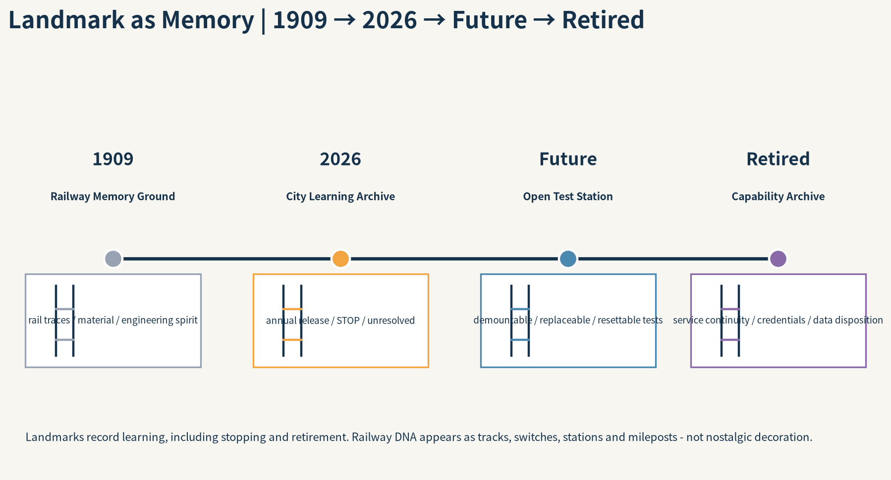

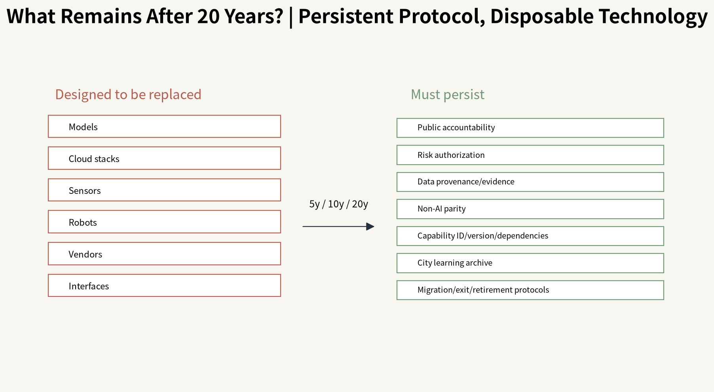

## Renewal Projects, Implementation Policy, and Phasing

Implementation is no longer three blanket time polygons. Every component is tagged Permanent / Adaptive / Experimental and given a reversibility field. A proposed annual rhythm is Q1 Diagnose → Q2 Sandbox/Authorize → Q3 Trial/Transfer → Q4 Evidence/Release. The annual **City Version Release** discloses Added, Modified, Scaled, Responsible STOP, Retired, unresolved problems and evidence changes. [data:geometry/phasing.geojson#PHASE-001] [assumption:A-INSTITUTION-001]

Public Stewardship retains final accountability for rules, authorization, data governance, public-value judgment, incidents and STOP/MODIFY/CONTINUE/SCALE/RETIRE decisions. Universities, companies, developers and citizens contribute through separate Problem and Capability Tracks.

To fully answer `agent.6`, long-term operations use six interlocking civic mechanisms:

1. **Annual Urban Learning Conference / City Version Release:** publicly review Added / Modified / Scaled / Responsible STOP / Retired items, evidence changes and the next challenge cycle.
2. **Developer Commons:** quarterly City Challenge Boards, capability clinics, documentation maintainers, open interfaces and risk-tiered sandbox slots create a durable developer community whose contributions and versions remain traceable.
3. **Scenario Open Days:** risk-tiered test windows publish participation rules, consent layers, nonparticipant bypass, human STOP authority, incident response and exit conditions before any opening.
4. **Public Experience Route:** an accessible day/night route links 1909 Railway Memory → 2026 Learning Archive → Future Experiment Station with everyday PCI nodes; it must first work as ordinary public space rather than a closed technology demo trail.
5. **International Communication:** bilingual Capability Registry, annual Evidence Report, open challenges and Urban Learning Conference materials communicate reproducible results rather than promotional claims.
6. **Attraction & Conversion:** Challenge → Sandbox → Pilot → Public-Value Review → **procurement/partnership/scaling consideration**; procurement, investment promotion, policy funding or partnerships remain subject to lawful later evaluation and are never guaranteed government purchases or signed commitments.

The operating rhythm therefore combines continuous year-round iteration with an annual public-accountability moment. Long-term brand assets are Open Node, the Capability Registry, version archives, public routes and developer contribution records rather than a one-off event logo. [source:AGENT-TASKBOOK] [assumption:A-INSTITUTION-001]
<!-- OFFICIAL-COMPLETENESS:AGENT6 -->

Long-term operation should maintain four resource ledgers: (1) non-AI baseline services and ordinary public realm; (2) challenge, sandbox and small-pilot resources; (3) maintenance, human alternative, migration and exit reserve; and (4) independent audit, affected-group participation and annual version-release resources. These are governance proposals, not claims of existing budgets, procurement or operators. [assumption:A-INSTITUTION-001]

The City Version Release is an annual public-audit interface rather than a promotional screen. It discloses Added / Modified / Scaled / Responsible STOP / Retired items, evidence changes, complaints and human takeover, unresolved problems and the next challenge cycle.

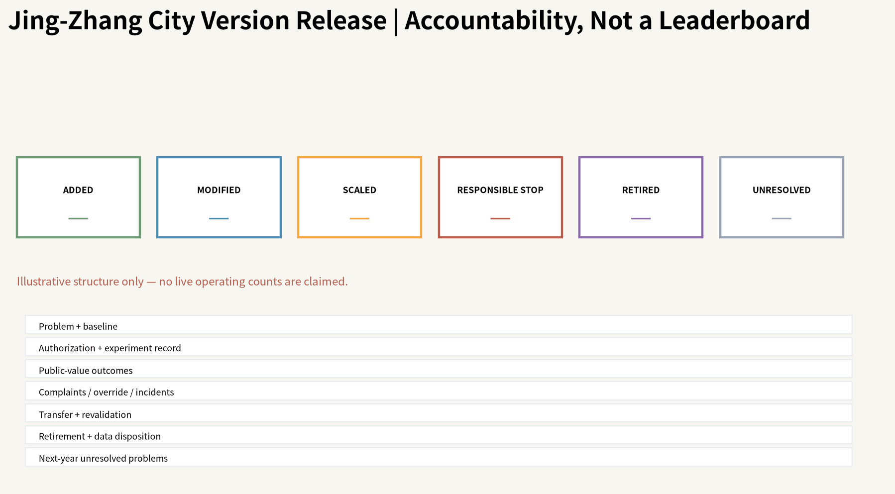

## Metrics, Area Recalculation, and Compliance Matrix

**Organizer-requested industry and talent indicators: define first, measure later.** In addition to UAR, the package now exposes auditable `Unknown` formula interfaces for the indicators named by the organizer: `ai_innovation_index` (composite of verified innovation inputs, transfer outcomes, open collaboration and validated public-capability outputs, with weights to be co-defined by the client/professional team), `ai_talent_density_per_sqkm` (AI talent under a declared statistical definition / official statistical area), `ai_output_value_cny` (AI-related output value under a consistent year and industry definition), `ai_industry_space_scale_sqm` (verified AI-industry GFA), and `industry_function_mix_ratio` (verified industry/research/service/public-function area structure). Because the official statistical boundary, enterprise roster, talent/output data and complete GFA are unavailable, all five remain `unknown/null`; formula readiness must not be presented as measured performance. [metric:ai_innovation_index] [metric:ai_talent_density_per_sqkm] [metric:ai_output_value_cny]
<!-- OFFICIAL-COMPLETENESS:OFFICIAL-METRICS -->

The flagship **Urban Adaptation Rate (UAR)** does not count AI deployments. It asks what share of qualified eligible urban problems achieve verified public-value improvement within a pre-registered evaluation horizon. Raw Agent detections do not enter the denominator; a Responsible STOP is valuable learning/safety but not automatically adaptation of the underlying problem. [metric:urban_adaptation_rate] [assumption:A-GOV-OPS-001]

Common public-value floors cover safety, equity, privacy, environment, cost and human override, while each scenario adds 2–4 measurable outcomes. Public dashboards also show failures, complaints, manual takeover, extremes, vulnerable-group gaps and unresolved cases. Current geometric values are reproducible but remain limited by provisional/design geometry status. [metric:green_ratio] [metric:public_space_ratio]

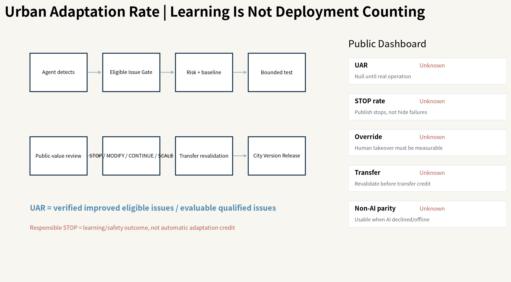

## Risk, Copyright, and Compliance

This is an open co-creation proposal, not a government determination, statutory plan, investment commitment, engineering permit or construction basis. Real personal-data, automated-decision, algorithm, generated-content, safety and accessibility obligations require deployment-specific legal/professional review; the risk matrix is only an urban-governance design interface. [source:AGENT-TASKBOOK] [assumption:A-INSTITUTION-001]

All diagrams, SVG, HTML and PDFs in this package are programmatically generated for the proposal and use no third-party photographs, commercial map tiles, remote fonts or tracking. OSM was actually materialized through Overpass on 2026-08-09 with 5,532 usable features, including 1,898 building polygons, and remains candidate context only. Microsoft's 2026-07-24 public index was also queried live, but it publishes no partition for target L9 quadkey `132100103`; therefore no OSM↔Microsoft match rate is fabricated. Neither dataset replaces official survey, redline or statutory planning evidence. [source:SRC-OSM-OVERPASS-LIVE] [source:SRC-MS-GLOBAL-BUILDINGS-20260724]

## References

Complete provenance, licence, dates, permitted uses and limitations are in `sources.json`; metrics and formulas are in `metrics.json`; spatial state is in GeoJSON; task, standard and design-depth coverage are in the three matrices. The v2 narrative keeps only claim-adjacent evidence anchors for human readability. [source:SOURCE-REGISTRY] [source:OFFICIAL-ANNOUNCEMENT]

The evidence system separates factual sources, design derivations, reproducible metrics and unresolved data gaps instead of treating all links as equal authority. `sources.json` records publisher, URL, retrieval date, licence, permitted use and limitations; every GeoJSON feature distinguishes official/provisional/existing/design roles; `metrics.json` marks only geometry- or formula-reproducible values as known, while FAR, complete building stock, statutory heights, municipal capacity and live UAR remain Unknown. OSM was live-materialized through Overpass on 2026-08-09: 5532 usable features inside the provisional envelope, including 1898 building polygons. They are promoted only to candidate existing-condition evidence, never to official survey or statutory geometry. The Microsoft 2026-07-24 published partition index was also queried live (HTTP 200, 30340 rows), but it contains 0 exact partition for target L9 quadkey `132100103` and 0 China rows; therefore no site Microsoft building partition is currently available and no OSM↔Microsoft building match rate is manufactured. When exact organizer SITE_BOUNDARY / KEY_AREA polygons, statutory controls, ownership, complete buildings, road redlines, heritage and utilities become available, Source Triangulation must revalidate geometry, metrics, the five primary diagrams, sections and exact key-area hosts, with changes recorded in the City Version Release. The narrative keeps claim-adjacent anchors; `sources.json`, `assumptions.json`, the three matrices and `self_check.json` carry the full audit trail. [source:SOURCE-REGISTRY] [source:OFFICIAL-ANNOUNCEMENT]

The live open-basemap audit is recorded separately: 5532 OSM features / 1898 building polygons were materialized, while the current Microsoft index publishes no partition for `132100103`. Both results remain evidence for verification queues and design context, not official planning facts. [source:SRC-OSM-OVERPASS-LIVE] [source:SRC-MS-GLOBAL-BUILDINGS-20260724]

