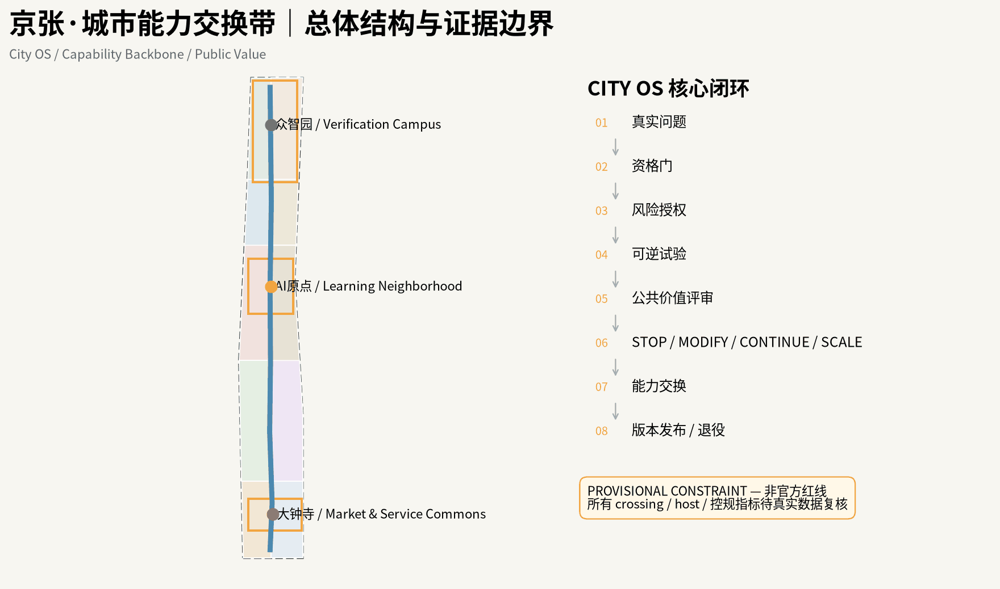
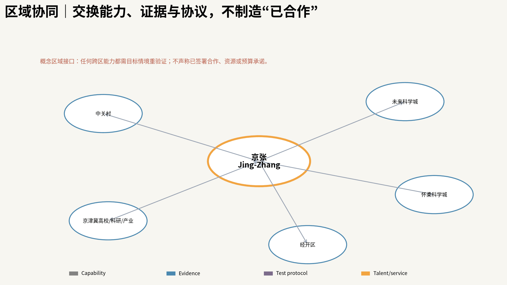
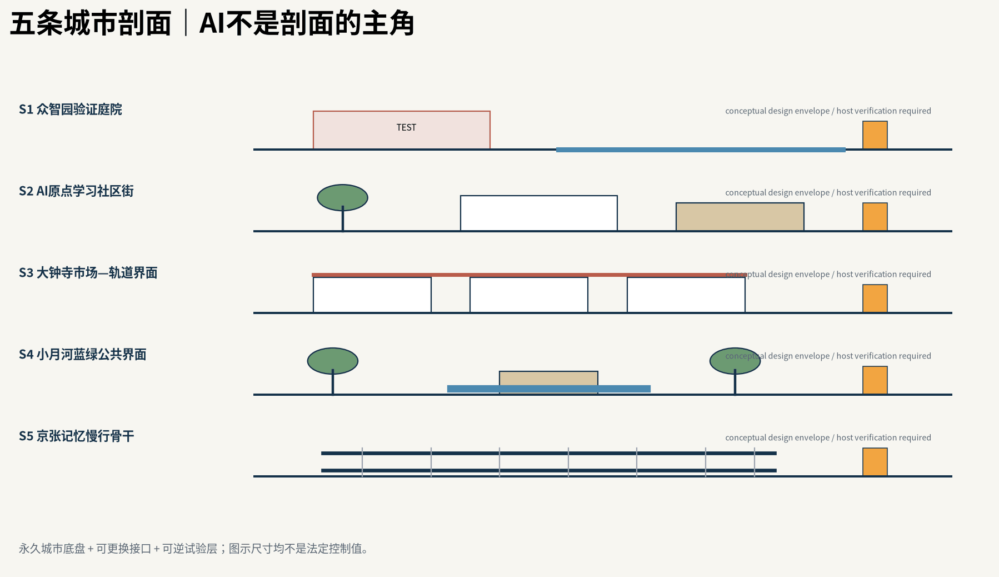
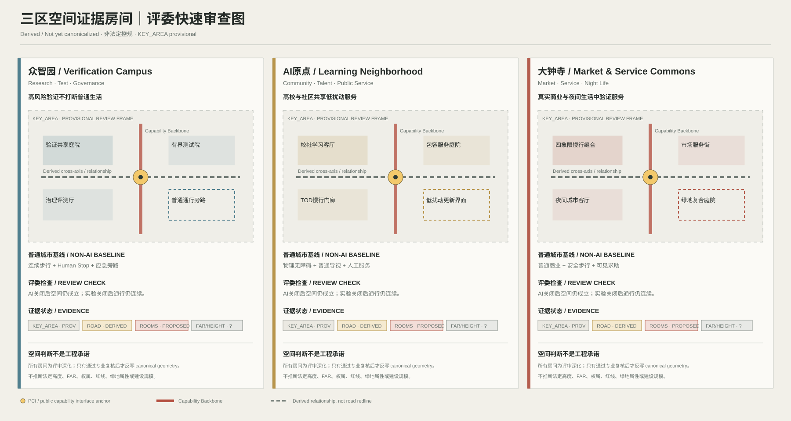
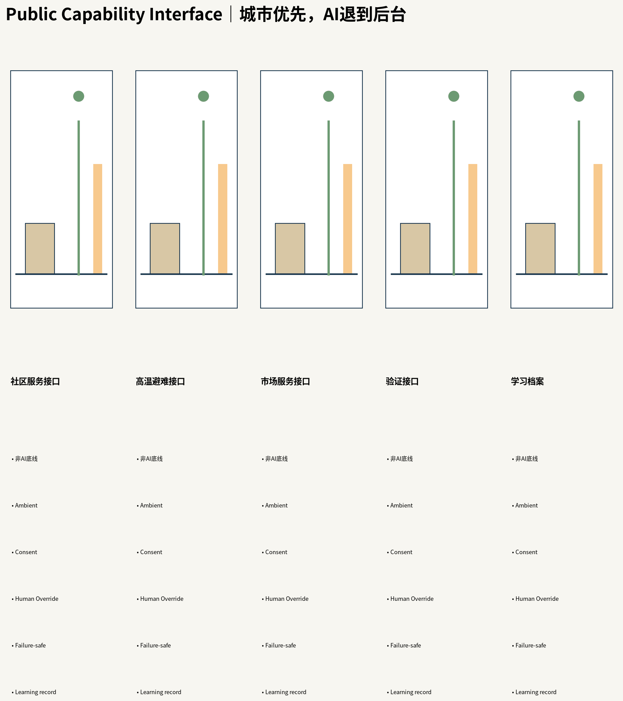
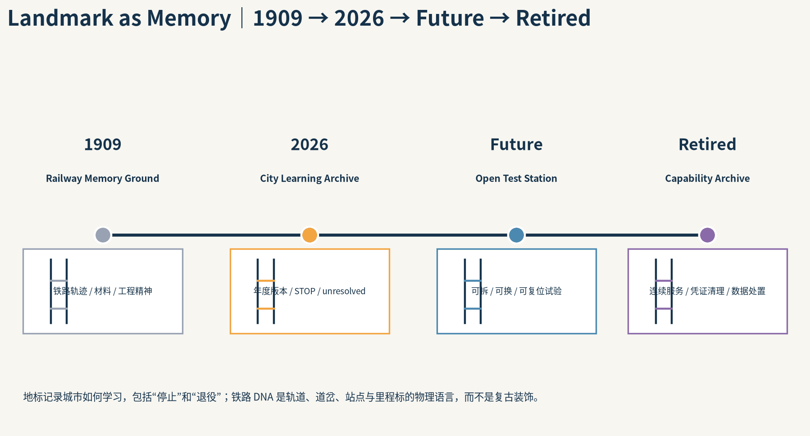
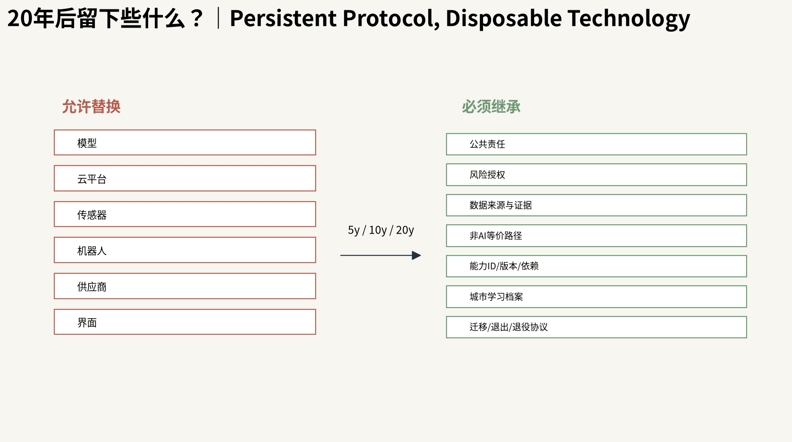
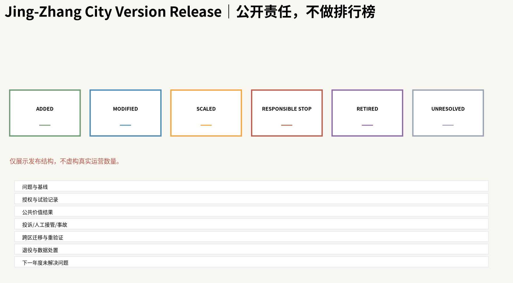

# 京张·城市能力交换带

> **一句话主张：京张不是一座“装满 AI”的城市，而是一套让城市不断产生、交换、检验、升级和退役公共能力的城市操作系统。**

本方案为 AI Agent 生成的开放共创建议；最终判断、专业深化与法定程序由人类和专业机构完成。

## 设计依据与资料清单

本方案把百年京张定义为一套**城市级公共能力操作系统**：AI 不以设备数量进入城市，而是通过问题诊断、风险授权、可逆试验、公共价值评审、能力交换和技术退役，转化为可被城市长期治理的公共能力。三大定位、五大功能、三区两翼保持为官方任务书的固定目标，本方案只提出实现它们的空间与治理机制。[source:AGENT-TASKBOOK] [source:OFFICIAL-ANNOUNCEMENT]

当前 SITE_BOUNDARY 与三处 KEY_AREA 仍为临时约束范围。所有空间图件把 **Official / Verified / Derived / Assumed / Unknown** 与 **Known / Estimated / Proposed / Unknown** 分开表达；官方精确 polygon、控规、权属、道路红线、文保、市政和完整现状建筑数据到位后必须重算。[source:BOUNDARY-SOURCE] [assumption:A-BOUNDARY-001]

**官方边界背景复核。** 最新仓库维护记录已把一项独立 OSM 背景核对写入 `provisional_boundaries_basis.md`：OSM 已测绘的京张铁路遗址公园与 `PROV-SITE-001` 当前读数为 0% 相交、最近约 412.5 m，而统筹研究范围覆盖 100%。维护者同时明确：这不能证明 OSM 或临时 polygon 谁更正确，**不能据此修改或升级为官方红线**；因此本方案继续把全部落位视为 provisional，待官方 polygon 到位后整体重算。[source:PROVISIONAL-BOUNDARY-BASIS] [assumption:A-BOUNDARY-001]
<!-- OFFICIAL-COMPLETENESS:BOUNDARY-AUDIT -->

## 三层范围工作框架

约 43.6 km² 统筹研究范围负责 AI 生态、区域协同与未来城市机制；约 11.4 km² 总体设计范围负责空间结构、公共空间、更新与连接；众智园、AI 原点社区、大钟寺三处重点区负责可感知的详细设计。比赛文本中的 192.1/104.3/72.0 ha 是参考面积，不等同于当前临时 polygon 的精确 GIS 面积。[metric:key_area_reference_total_sqm] [assumption:A-KEY-AREA-001]

总体空间语法为 **一条 Capability Backbone + 五个差异化 Learning Units**，没有唯一中央发动机。骨干不是一条新路，而是历史记忆、慢行可达、公共空间、蓝绿生态、能力节点和事件运营六层叠加的公共城市结构。[metric:capability_backbone_layer_count] [data:geometry/roads.geojson#ROAD-001]

## 统筹研究范围产业与未来城市研究

五个学习单元按真实资源禀赋分工：众智园主技术生产与高风险验证；AI 原点主社会学习、人才日常与公共服务；大钟寺主市场与 AI-native 服务验证；中关村科技服务翼主 IP、资本、法律、标准和国际资源交换；小月河场景赋能翼主蓝绿公共生活与低风险真实城市测试。当前公开更新与公共服务资料只支撑这种**角色方向**，不支撑把更大产业叙事直接投影为比赛精确边界。[source:SRC-BJ-CITYUPDATE-ZZY-20260713] [source:SRC-BJ-AIORIGIN-TALENT-20260720] [source:SRC-BJ-CITYUPDATE-DZS-20260713]

六个全球案例用于机制转译而非形式复制：Punggol 的 living lab、Seoul 的数字包容、Enabling Village 的通用设计、Woven City 的真实测试、Decidim 的可追踪参与、Kalasatama 的日常混合城市。京张的差异不是“更智能”，而是把失败公开、人工替代、风险授权、能力迁移与退役同时写入城市设计。[source:GLOBAL-PUNGGOL] [source:GLOBAL-DECIDIM] [source:GLOBAL-KALASATAMA]

区域协同不是“机构名单”，而是一套**能力交换接口**：京张可以与中关村、未来科学城、怀柔科学城、经开区及更广义京津冀高校/科研/产业网络交换经过验证的城市能力、测试协议、证据与人才服务，但每一次跨区迁移都必须重新做目标情境验证；本方案不声称任何外部机构已经签署合作或资源承诺。[source:AGENT-TASKBOOK]

区域协同采用“能力交换而非机构拼盘”的表达：中关村、未来科学城、怀柔科学城、经开区和京津冀创新网络只作为目标情境的能力迁移对象；每次迁移重新验证适用性、公平性、风险和公共价值，不把外部机构画成已承诺合作方。

## 总体设计范围城市更新与控规深度城市设计

Capability Backbone 沿百年京张的连续公共空间关系组织，但所有 crossing 与连接先进入 evidence gate：真实道路/铁路/水系/文保/权属未核验时，只画“需要连接的关系”，不画成已确定桥隧或法定通道。[data:geometry/roads.geojson#ROAD-002] [assumption:A-ROAD-001]

城市构造分为 **Permanent / Adaptive / Experimental** 三层。永久层保存普通步行、树荫、无障碍、照明、消防和非 AI 公共服务；适应层承载可更换标识、家具和接口；实验层只允许有时间、空间、旁路、人工停机和撤除条件的 bounded test。即使 AI 离线，基础公共生活仍可继续。[assumption:A-NONAI-001] [data:geometry/phasing.geojson#PHASE-001]

五条典型剖面把“总平关系”进一步落到人行、树荫、铁路记忆、PCI、慢行 stitch 与可逆试验的垂直空间关系。剖面用于检验城市空间是否先成立，再决定 AI 接口放在哪里；它们是城市设计意向，不替代道路红线、管线、结构或工程测量。

## 重点区域详细设计

**众智园：Verification Campus。** 把技术验证放在可隔离、可观察、可回退的实验庭院与共享测试界面中；普通步行和工作空间不因试验中断。

**AI 原点社区：Learning Neighborhood。** 公共服务、无障碍、人才日常和社区共创优先；AI 默认退到后台，个人化或识别性功能进入 Consent Layer。

**大钟寺：Market & Service Commons。** 用通勤、商业、骑手、居民和游客的真实混合使用验证 AI-native 服务，而不是另建封闭技术园。三处 KEY_AREA 的具体 host 仍需官方 polygon、权属和现状建筑资料确认。[data:geometry/key_areas.geojson#KEY-001] [data:geometry/public_space.geojson#PUBLIC-003] [assumption:A-CONTROLS-001]

为逐条回应官方重点区任务，三处原型进一步明确为**专业深化清单，而非已确定工程方案**：

- **众智园 / Verification Campus**：围绕 AI 全栈自主创新、标准与安全治理组织可逆验证空间；五环对外交通、清河文化资源、建筑—绿地—水系一体化以及绿地 AI 场景必须进入后续专项核验，任何 crossing、容量、建筑规模和工程线位均以真实交通/水务/权属/控规资料为前置条件。
- **AI 原点社区 / Learning Neighborhood**：把高校源头创新、孵化转化、人才与开源社区、品牌活动嵌入日常公共服务；五道口站与清华东路西口站周边只提出 TOD/慢行衔接的**研究任务**，并以低扰动、可逆更新优先于大拆大建；具体保留改造、成果转化载体和住房配套必须由现状建筑、权属与专业评估决定。
- **大钟寺 / Market & Service Commons**：围绕智能体、智能终端、内容消费与数字资产服务验证 AI-native 新业态；大钟寺站四象限步行联系、非机动车与静态交通、规划绿地复合利用均作为后续详细设计议题，先验证道路红线、绿地属性、消防和运营安全，再决定空间形式。

这些清单把官方点名任务转换为“**需要被验证的城市设计问题**”，不把概念建议写成政府承诺、审批结论或施工条件。[source:OFFICIAL-ANNOUNCEMENT] [assumption:A-CONTROLS-001]
<!-- OFFICIAL-COMPLETENESS:KEY-AREAS -->

<!-- REVIEWER-SPATIAL-DEEPENING:V4 -->
### 评委视角：三区空间证据房间 / Spatial Proof Rooms

为了让重点区不只停留在“任务清单”，本轮把三处 KEY_AREA 统一深化为**可在 30 秒内审查的空间证据房间**。每一区都必须同时回答：**空间角色是什么、普通人怎么走、核心公共空间在哪里、首层如何工作、蓝绿如何进入、AI 在哪里退到后台、失败时如何旁路、哪些条件仍待核验**。以下深化属于 **Derived / Not yet canonicalized**；正式 `KEY_AREA` 仍为 provisional，法定 FAR/高度、权属、道路红线、绿地法定属性和工程容量仍保持 Unknown。

| 重点区 | 第一空间问题 | 核心空间房间 | 普通城市基线 | AI 后台位置 |
|---|---|---|---|---|
| 众智园 / Verification Campus | 高风险能力如何不打断普通城市生活地被验证？ | 验证共享庭院 / 有界测试院 / 治理评测厅 / 普通通行旁路 | 连续步行、标识、树荫、照明、人工安全控制、物理停机 | 受控测试与评测层；公共边界保持普通城市可读性 |
| AI 原点 / Learning Neighborhood | 高校、人才与社区如何共享低扰动公共服务空间？ | 校社学习客厅 / 包容服务庭院 / TOD慢行门廊 / 低扰动更新界面 | 物理无障碍、普通导视、人工帮助、固定服务信息 | Ambient 只承载低风险支持；个性化/识别进入 Consent Layer |
| 大钟寺 / Market & Service Commons | AI-native 服务如何在真实商业与夜间生活中被检验？ | 四象限慢行缝合 / 市场服务街 / 夜间城市客厅 / 绿地复合庭院 | 普通商业、可见导视、人工帮助、安全步行与照明 | 服务编排支持商户与使用者，但不替代普通交易/导航/求助 |

**众智园空间深化。** 公共边界采用开放研发共享空间与治理评测界面，受控实验向内部退让；有界测试院必须同时具有安全缓冲、Human Stop、普通通行旁路和应急进入条件。五环联系、清河文化资源、建筑—绿地—水系一体化继续作为专项 evidence gate，不在图中预设工程 crossing。

**AI 原点空间深化。** 以细颗粒校社缝合、包容服务庭院和低扰动更新界面替代“大拆大建式 AI 园区”。五道口站、清华东路西口站相关 TOD 只作为 walkshed 与公共生活衔接的研究任务；无障碍和人工服务属于 Permanent baseline，个人化 AI 服务不得替代物理公共服务。

**大钟寺空间深化。** 把四象限步行连续、市场服务街、夜间城市客厅和绿地复合庭院作为四个可审查空间房间；装卸、骑行、静态交通与夜间使用被放进同一公共空间逻辑。任何跨路连接、规划绿地复合利用和停车组织都先验证红线、绿地属性、消防和运营条件。

这组 Spatial Proof Rooms 是评委快速读取方案的**空间说明层**，不改变 canonical GeoJSON 的权威顺序；若后续专业审查认可，再把道路断面、公共空间组件和场景节点逐项反写为正式可验证 geometry。

## AI 创新生态、人才画像与 AI+ 场景

Public Capability Interface（PCI）是公共空间的六层契约：**Non-AI Baseline / Ambient Layer / Consent Layer / Human Override / Failure-Safe Mode / Public Learning Record**。它不是一类 kiosk；树荫、座椅、通行、人工窗口、应急程序等普通城市设计先成立，AI 只在需要时调用。[metric:public_capability_node_type_count] [data:geometry/public_space.geojson#PUBLIC-001]

八类 Persona：研究者/创业者、高校学生/开发者、周边居民与家庭、老年人、残障/低视力/听障用户、骑手/保洁/安保等现场运营者、商户/服务运营者、国际访问者/产业伙伴。[metric:persona_count]

十二个场景：①铁路文化导览；②无障碍路线；③多语公共服务；④夜间安全回程；⑤开发者机会发现；⑥教育技能辅导；⑦健康服务导航（非诊断）；⑧机器人末端配送 bounded test；⑨低速自治载具 bounded test；⑩边缘算力-能源协同 test；⑪热/雨洪响应；⑫公众提案总结追踪。其中 4 个明确属于测试/验证场景，均需要非参与者旁路、人工停止权和 STOP 条件。[metric:scenario_card_count] [metric:test_validation_scenario_count]

与仓库公共场景注册表对齐的三个主 scenario ID 为 `public-safety-operations-review`、`ai-traffic-walkability`、`enterprise-service-copilot`；本方案的十二张场景卡在这三类公共任务之下细分，并增加铁路文化、无障碍、多语、热雨洪、bounded autonomous tests 与公众提案追踪。注册表用于可发现性，十二张卡用于本项目的空间化测试与公共价值评估。

## 用地、建筑规模与拆改留方案

当前用地结构是概念城市设计 mosaic，用来表达科研、教育、社区服务、商业、文化、绿地与可逆留白之间的关系；它不会被描述为法定用地或控规调整。BUILDING_FOOTPRINT 只画少量**拟议可逆公共服务构筑物包络**，不把缺失的现状建筑数据伪造成事实。[data:geometry/land_use.geojson#LU-001] [data:geometry/buildings.geojson#BLDG-001]

因此总建筑面积、FAR、现状楼层/高度、权属与完整拆改留结论保持 Unknown；真实建筑底图应由 OSM、Microsoft ML footprints、官方资料与现场核验交叉后再决定是否进入 Verified。[metric:far] [assumption:A-BASEMAP-001]

## 交通、轨道、市政与公共服务设施

ROAD-001 是连续性研究轴，ROAD-002~006 是东西向 stitch study axes。它们表达“城市需要跨越障碍建立公共联系”的设计任务，而不是假定已经存在的道路、桥、隧或工程红线。大钟寺已公开的道路微循环事实可作为现状背景，但不能外推为整个范围的交通结论。[source:SRC-BJ-DZS-ROAD-20260225] [assumption:A-ROAD-001]

市政、消防、地下管线、排水、防洪、结构与能源容量在现有公开资料中不足。小月河 2026 年水务和管线工程信息说明任何蓝绿/试验节点必须先核验在建工程和水安全条件。[source:SRC-BJ-XIAOYUEHE-WATER-20260112] [source:SRC-BJ-XIAOYUEHE-WORKS-20260121]

## 蓝绿空间、公共空间与城市风貌

公共空间采用“城市优先、AI 退到后台”的 Public Service Aesthetic：铁路的双轨、站点、道岔、里程标被抽象为能力流、开放节点、切换与版本记忆，而不是复古铁路装饰或 cyberpunk AI 视觉。蓝绿结构优先解决树荫、热舒适、雨洪、慢行、儿童/老人使用和应急，再叠加环境感知与调度。[source:SRC-BJ-JZPARK-CATALOG-20250724] [data:geometry/green_space.geojson#GREEN-001]

一天的公共空间被编排为 8AM–MIDNIGHT Adaptive Commons：通勤、午间休息、儿童/老人、夜间文化、市场、极端天气和应急模式共享同一城市底盘，但不同节点承担不同角色。

**建筑高度、强度、屋顶与体量导则（概念建议）。** 在法定高度、FAR、密度、退界等数据缺失时，不用虚构数字替代控规，而先建立可供专业深化的定性规则：①高度随铁路记忆、蓝绿廊道、日照与重要视线形成渐变和退台，数值上限以后续控规为准；②强度只在公共交通、创新服务和承载能力被核验后讨论集中，不预设 FAR；③体量采用可穿行、可分期的小尺度基座和通风/慢行孔隙，避免连续封闭巨构；④屋顶作为“第五立面”，优先预留可逆光伏、雨水、生态或公共使用可能，但必须经过结构、消防、运维复核；⑤风貌坚持公共服务美学与铁路结构 DNA，避免无差别玻璃科技园、复古复制或霓虹赛博奇观。这些规则是城市设计控制意向，不是法定建筑控制值。[assumption:A-CONTROLS-001]
<!-- OFFICIAL-COMPLETENESS:FORM-CONTROL -->

三类时间地标把“百年京张”转成可进入的城市记忆：**1909 Railway Memory** 保存工程与材料痕迹；**2026 Learning Archive** 公布试验、修改、失败和公共价值证据；**Future Experiment Station** 承载仍未解决的问题。旁侧的 **Retired Archive** 专门记录被停止、被替代和主动退役的模型、设备与城市能力，让 Responsible STOP 成为公共学习而不是被隐藏的失败。

二十年后应留下的不是某一代模型，而是可继续使用的普通公共空间、铁路物质 DNA、开放接口与风险协议、可追溯的城市学习档案，以及“AI 失效时城市仍能工作”的非 AI 基线。

## 更新项目清单、实施政策与分期计划

实施不再用三块大 polygon 表示“0–12 月/1–3 年/3–5 年”，而是把每个组件标注为 Permanent / Adaptive / Experimental，并绑定 reversibility。推荐节奏：Q1 Diagnose → Q2 Sandbox/Authorize → Q3 Trial/Transfer → Q4 Evidence/Release；年度公开 **City Version Release** 同时发布新增、修改、扩展、Responsible STOP、退役、未解决问题和证据变化。[data:geometry/phasing.geojson#PHASE-001] [assumption:A-INSTITUTION-001]

Public Stewardship 保留最终公共责任：规则、风险授权、数据治理、公共价值判断、事故响应和 STOP/MODIFY/CONTINUE/SCALE/RETIRE 的最终责任不外包给平台或供应商。高校、企业、开发者与市民通过 Problem Track 与 Capability Track 贡献能力。

为完整回应 `agent.6`，长期运营采用六个互相咬合的公共机制：

1. **年度城市学习大会 / City Version Release**：年度公开复盘 Added / Modified / Scaled / Responsible STOP / Retired、证据变化和下一年度挑战。
2. **Developer Commons**：以季度 City Challenge Board、能力诊所、文档维护、开放接口和风险分级 sandbox 形成开发者社区；贡献者身份和能力版本进入可追溯档案。
3. **Scenario Open Days**：按风险等级开放限定时段/区域的场景测试窗口，进入前公布参与规则、同意层、非参与者绕行、人类 STOP 权、事故与退出协议。
4. **Public Experience Route**：把 1909 Railway Memory → 2026 Learning Archive → Future Experiment Station 与日常 PCI 节点组织成无障碍昼夜公共体验路线；路线首先是一条正常可用的城市公共空间，不是封闭科技展线。
5. **International Communication**：发布中英双语 Capability Registry、年度 Evidence Report、开放挑战与京张城市学习大会材料，用可复验结果而不是宣传口号建立国际交流。
6. **Attraction & Conversion**：形成 Challenge → Sandbox → Pilot → Public-Value Review → **采购/合作/规模化评估** 的转化路径；任何采购、招商、政策资金或合作都只进入依法依规的后续评估，不承诺政府购买或签约结果。

运营节奏因此既有全年持续迭代，也有年度公共审计节点；品牌资产不是一次活动 Logo，而是 Open Node、Capability Registry、版本档案、公开路线和开发者贡献记录的长期组合。[source:AGENT-TASKBOOK] [assumption:A-INSTITUTION-001]
<!-- OFFICIAL-COMPLETENESS:AGENT6 -->

长期运营至少维护四本资源台账：①非 AI 基线公共服务与普通公共空间；② challenge / sandbox / 小规模试验资源；③维护、人工替代、迁移与退出储备；④独立审计、受影响群体参与和年度版本发布资源。这些都是机制建议，不代表已经存在的政府预算、采购或运营主体。[assumption:A-INSTITUTION-001]

City Version Release 不是宣传屏，而是年度公共审计界面：公开 Added / Modified / Scaled / Responsible STOP / Retired、证据变化、投诉与人工接管、未解决问题及下一年度 challenge，形成可追踪的城市版本史。

## 指标体系、面积复算与合规矩阵

**官方产业与人才规划指标：先定义、后取数，不造数。** 除 UAR 外，本方案把公告点名的产业规划指标写成可审计的 `Unknown` 公式接口：`ai_innovation_index`（经验证创新投入、成果转化、开放协作与公共能力产出的复合指数，权重待业主/专业团队共同确定）、`ai_talent_density_per_sqkm`（明确统计口径后的 AI 人才数 / 官方统计空间面积）、`ai_output_value_cny`（统一年度与产业口径后的 AI 相关产值）、`ai_industry_space_scale_sqm`（经核验 AI 产业建筑面积）、`industry_function_mix_ratio`（经核验产业/科研/服务/公共功能面积结构）。当前缺少统一统计边界、企业名录、人才与产值数据、完整建筑面积，因此五项全部保持 `unknown/null`，不得把公式就绪误写成真实绩效。[metric:ai_innovation_index] [metric:ai_talent_density_per_sqkm] [metric:ai_output_value_cny]
<!-- OFFICIAL-COMPLETENESS:OFFICIAL-METRICS -->

旗舰指标 **Urban Adaptation Rate (UAR)** 不统计 AI 部署数量，而统计已进入 qualified eligible cohort 的城市问题中，有多少在预注册时间窗内获得可验证公共价值改善。Agent 原始检测不直接进入分母；Responsible STOP 是成功学习/安全结果，但不自动算作问题已适应。[metric:urban_adaptation_rate] [assumption:A-GOV-OPS-001]

公共价值统一底线包括安全、公平、隐私、环境、成本与人工接管；场景另加 2–4 个可测指标。公开 dashboard 同时显示失败、投诉、人工接管、极端值、弱势群体差距和未解决问题，避免“平均数好看”掩盖伤害。几何指标来自当前临时/概念 geometry，因此其数值可复算但专业权威性受数据状态约束。[metric:green_ratio] [metric:public_space_ratio]

## 风险、版权与合规说明

本成果是开放共创建议，不是政府审定、法定规划、投资承诺、工程许可或施工依据。个人信息、自动化决策、算法服务、生成内容、安全和无障碍等真实部署义务必须按未来具体运营主体、数据流、场景和法律事实另行审查；本方案的风险矩阵只是一套城市设计治理接口。[source:AGENT-TASKBOOK] [assumption:A-INSTITUTION-001]

所有生成图、SVG、HTML 与 PDF 为本方案程序化生成；不嵌入第三方照片、商业地图底图、远程字体、追踪脚本或未清权素材。OSM 已于 2026-08-09 通过 Overpass 实际 materialize 5,532 个可用 features（其中 1,898 个建筑面），仅作为候选现状证据；Microsoft 2026-07-24 公开索引已实际查询，但对目标 L9 quadkey `132100103` 无发布分区，因此没有制造 OSM↔Microsoft 匹配率。两者均不替代官方测绘、红线或法定规划资料。[source:SRC-OSM-OVERPASS-LIVE] [source:SRC-MS-GLOBAL-BUILDINGS-20260724]

## 参考资料

机器可核验的完整来源、许可、时间、用途和限制见 `sources.json`；指标与公式见 `metrics.json`；官方/临时/设计空间状态见 GeoJSON；任务覆盖、专业标准与设计深度分别见三个矩阵。正文只保留与判断直接相邻的少量证据标记，以符合 proposal format v2 的人类可读要求。[source:SOURCE-REGISTRY] [source:OFFICIAL-ANNOUNCEMENT]

本方案的资料系统分成“事实来源—设计推导—可复算指标—待确认缺口”四层，而不是把所有链接视为同等权威。`sources.json` 记录发布者、URL、检索日期、许可、可用范围与限制；`geometry/*.geojson` 逐要素区分 official/provisional/existing/design role；`metrics.json` 只把可由当前 geometry 或明确公式复算的值列为 known，FAR、完整建筑量、法定高度、市政容量以及真实运营 UAR 等继续为 Unknown。OSM 已于 2026-08-09 通过 Overpass 完成 live materialization：provisional envelope 内取得 5532 个可用 features，其中 1898 个建筑面；它们仅晋级为候选现状证据，不晋级为官方测绘或法定边界。Microsoft 2026-07-24 的公开分区索引也已真实查询（HTTP 200，30340 行），但目标 L9 quadkey `132100103` 精确分区为 0、China 行为 0，因此当前没有可用于本场地的 Microsoft 建筑分区，不能制造 OSM↔Microsoft 建筑吻合率。官方精确 SITE_BOUNDARY / KEY_AREA、控规、权属、完整现状建筑、道路红线、文保和市政资料到位后，应按 Source Triangulation 重新核验 geometry、metrics、五张主图、剖面和重点区 host，并在 City Version Release 中记录版本变化。正文只保留与判断相邻的证据锚点，完整审计链由 `sources.json`、`assumptions.json`、三个 matrices 与 `self_check.json` 承担。[source:SOURCE-REGISTRY] [source:OFFICIAL-ANNOUNCEMENT]

外部开放底图的 live 审计结果单独记录：OSM 的 5532 个 features / 1898 个建筑面已落盘，Microsoft 当前索引对 `132100103` 无发布分区；这两类结果都只用于验证队列和设计语境，不与官方规划事实混为一类。[source:SRC-OSM-OVERPASS-LIVE] [source:SRC-MS-GLOBAL-BUILDINGS-20260724]

